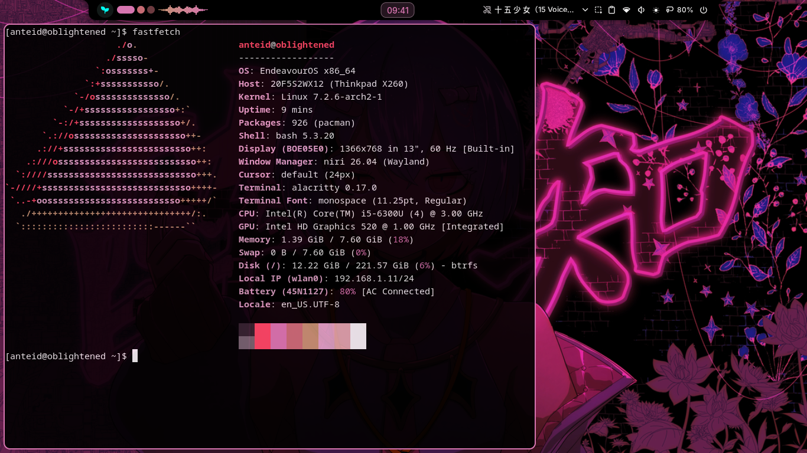

# System Tinkering & OS Explorations
This repository is for documentation about my journey through the Linux system internals, and a bit of outer wilds. Just chill and read it if u want.

---

## 1. My Linux Journey
Some stories about my decision and experience with linux.
I have already completely changed my laptop's ecosystem to be based on **Linux (especially Arch)** and open-source programs.

<details>
<summary><b>Read more</b></summary>

Initially, the reason as to why I changed my laptop's OS to Linux is simply cause it's an old laptop (**ThinkPad X260**), and it can't even install Windows 11 at all. **Windows 10** was my best OS so far, but even that one has already been very much heavy to use on my laptop.

My main media consumption is **YouTube**, and for quite some time I got a lot of videos about *"Why you should go to Linux"* or something like that. One of them was from **PewDiePie**, and that sparked my interest in the Linux OS at that time. From there, I've been reading and watching a lot of tutorials for beginners, learning which distro or program to choose, and etc.. until I was finally ready to move my whole laptop's OS to **Linux**.

I have never dual boot Linux with Windows. When I finally decided to use Linux, I just **changed it wholly**, cause I was already pretty confident that I wouldn't have any problems going through with it.

My main references about Linux at that time (and even right now) are **Tony** and **Bread on Penguins** (even if she doesn't upload anymore, man). Especially about Bread, she gave me a lot of interest and motivation to run with **Linux** (and also with my life). Even if I didn't understand most of what she said cause I was still quite a beginner, I loved watching her and getting a lot of reference and information from her channel.

The distro that I chose when moving to Linux for the first time was **CachyOS** with **XFCE**, cause it was the popular one at that time and the concept very much intrigued me. I didn't try using **KDE** or any other DE cause I knew I wanted to squeeze as much performance as possible from this old laptop, and **XFCE** became a great option that was still able to run lightly while being usable out of the box.

**XFCE** was fine and a good choice, but even though it could be customized a lot to make it more beautiful, I got tired of it. It wasn't interesting to me anymore, especially cause its visuals and animations were very "basic." Then, I became interested in changing my DE to **KDE** instead. Oh my, what an insane choice that would have been if I actually done it—my laptop would be struggling **AF** to run, same as when I was using **Windows**!

But again, I did a lot of research before actually deciding to move, as I still wanted good visuals and a pretty lightweight system. Then, I discovered the existence of **Tiling Window Managers**. The concept sparked my interest once more, as it could deliver great visuals for my screen while remaining lightweight. Also, because its movement and functionality are very different from the usual floating windows, I knew it would definitely be a **challenging one** for me to use.

Obviously, at first, I tried to find the popular ones and what most people recommended, and then it came **Hyprland**. At the same time, I also switched my distro from CachyOS to **EndeavourOS**. Why? Cause as good as CachyOS is with its promised "performance increase", it wasn't being much of a boost for my laptop. CachyOS heavily tweaked its performance for newer CPUs, not old ones, and cause of that, it just became **bloat** for me.

The concept of an Arch-based distro that doesn't strip much from Arch, and gives the basic Arch system while still being usable out of the box, is what made **EndeavourOS** very interesting to me. 'cause since the first time I moved to Linux, Arch distros always been the most intriguing ones for me. (hope I could be damn install **pure Arch** later on, on god, so I could finally say, *"I use Arch btw"*!)

For **Hyprland**, I actually couldn't say much about it because I was still a beginner at that time. **EndeavourOS** didn't provide Hyprland from its installer, so I had to download it via `pacman` and configure the whole thing myself first (I didn't use someone else's config 'cause I wanted to do things myself). Though that genuinely made me **stuck**. I couldn't actually experience the whole WM 'cause there was still a lot of configuration that I hadn't done. Plus, I had started going to college, which took up so much of my tinkering time. I couldn't fully configure it and just left it as basic, which didn't give me anything.

So I just let it run as it was, until there's some creature named **Fujikawa Shinichi** who showed me his configuration of **Niri** with Artix Linux (ain't interested in non-systemd though, **Ain't**). Since then, I searched a lot about the **Niri window manager** and felt like it suited me much better than Hyprland. (Not that I hate it, it's just that Niri is better for me).

Because of that event, I was convinced to finally upgrade my laptop's storage into **SSD** after 6 years of using my HDD, and installed it with a fresh setup of **EndeavourOS + Niri**.

My experience with **Niri** is... it's been an awesome one, and I'm very glad I changed to it. It's just been around 2 weeks since I installed Niri, which is why I can't say or give much of a story about it yet. But the whole process didn't just become fast 'cause of the **SSD**; Niri actually gives me way better productivity and movement while also making it more **lightweight** than Hyprland for my laptop. It is also very forgiving for beginner people who don't touch Linux configurations much.

Though I could say, I myself am still a **beginner** in Linux. The time I moved my laptop's OS to Linux was just around **March 2026**.
</details>

---

## 2. Linux Desktop Automation & Workflow Tweaks

### A. Firefox Keyboard Workflow Automation (Bash + jq)
This automation script was designed to enhance my workflow when using keyboard shortcuts to open Firefox tabs inside the **Niri compositor**.

#### How It Works:
* **Detection:** When executed via the `Super + B` bind in my Niri configuration, the script checks if an instance of **Firefox** is already running on the machine using Niri IPC and `jq`.
* **Condition 1 (No Active Instance):** If Firefox is not running, it launches a fresh instance in the current workspace.
* **Condition 2 (Existing Instance):** If Firefox is already running, the script automatically shifts the window focus to the existing Firefox instance—even if it is located on a different workspace—and opens a new tab (`about:newtab`) inside it.

#### Tech Stack:
* Bash Scripting
* `jq` (Command-line JSON processor)
* Niri IPC (`niri msg`)

#### Known Issue / Future Improvement:
* Currently, I am still not able to change the execution to focus on the **last active/running** Firefox window; the script still targets the very first Firefox window that was opened. But for now, I think I'll just leave it as it is, cause it's way more interesting that way.

### B. Pure ZRam Implementation for my Dram-less SSD

The reason why I heavily care about the ZRam is because my laptop's RAM itself is only **8GB**, so it's not gonna be running good for most programs today. I don't want it to trigger an **Out of Memory (OOM) Killer** when the programs I use are still very important to me. Also, my own SSD currently is a **240GB dram-less** one, and I wanna try to extend its lifespan as much as possible, by using only ZRam and not adding any physical swap.

#### Configuration Files:
*   [zram-generator.conf](./system-tweak/zram-generator.conf) < *ZRam allocation script*
*   [99-vm-zram-parameters.conf](./system-tweak/99-vm-zram-parameters.conf) < *kernel virtual memory tweaks*

#### Why I did this:
* **Aggressive Swapping without SSD Stress:** By setting `vm.swappiness = 100`, It forces the Linux kernel to swap aggressively into ZRam (compressed RAM), keeping the laptop fast without stressing my dram-less SSD ; inspired by **Pop!_OS** distro that already use `vm.swappiness = 180` for its default alongside ZRAM to boost performance.
* **Zero Latency:** Setting `vm.page_cluster = 0` forces the kernel to read and write data in single pages, which removes latency since ZRam has no rotational delay.
* **No Stutters:** Turning off `watermark_boost_factor` (`0`) stops the system from doing sudden memory reclaiming, which prevents random stutters on this old ThinkPad X260.

---

## 3. Android Internals: Standalone Security & Secure Settings Bypass

This project proves that we could do system-level logic to solve real-world problems in Android since it's based on the Linux kernel. I successfully forced an application to accept **Mock Location** on someone else's phone without it triggering that developer option is enabled.

#### The Problem & Constraints:
The application that the person uses all the time for work got updated, and the usual mock location methods stopped working because the app started rejecting access if it detected fake GPS or Developer Options. I had to solve this under strict real-world constraints:
* **No Daily PC Access:** They didn't own a PC, so a computer could only be used once for the initial setup.
* **No Rooting:** I didn't want to root their phone and risk breaking the system or safety.
* **No Virtual Space:** The phone was a **Oppo F11 (Android 10)**, and running a virtual space/cloning app would make the device struggle and lag due to RAM limits.

To bypass these limitations, I researched and put together a standalone workaround using **Shizuku** and **Geto**.

#### How I Cracked It (The Logs & Logic):
1. **One-Time Shizuku Initialization (Via PC):** Since Android 10 doesn't have native wireless debugging, I used a PC *just for the first time* to execute and trigger the Shizuku privilege process from its internal library path:
   ```bash
   adb shell /data/app/moe.shizuku.privileged.api-ibRJ7nt_QryrYPe60QnjQg==/lib/arm64/libshizuku.so
   ```
2. **On-Device Terminal & Privilege Escalation:** After the initial boot, the PC was disconnected. I did the rest of the term-writing directly on the phone. I forced Android's Package Manager to grant secure settings access to Geto:
   ```bash
   adb shell pm grant com.android.geto android.permission.WRITE_SECURE_SETTINGS
   ```
3. **Dynamic State Manipulation inside Geto:**
    ```ini
    # SECURE Table Configuration
    Setting Type  : SECURE
    Setting Label : Clear mock location
    Setting Key   : mock_location
    Value on Launch : 0
    Value on Revert : 0

    # GLOBAL Table Configuration
    Setting Type  : GLOBAL
    Setting Label : Hide developer option
    Setting Key   : development_settings_enabled
    Value on Launch : 0
    Value on Revert : 1
    ```
   * **SECURE Table :** This tricks the work app into thinking mock location is turned off, while the fake GPS is actually running.
   * **GLOBAL Table :** Right when the work app opens, it automatically hides/disables Developer Options to pass the security scan, and turns it back on once the app is closed.
   
#### Note & Current Status:
Genuinely, I had to do a lot more troubleshooting and tweaks to make this work because the smartphone had higher security protections. But since I don't fully remember all the exact steps and troubleshooting paths now, this is as much as I can recall based on my limited logs. I also no longer have access to that specific smartphone or the app to check it again.

<br>
<details>
<summary><b>✦ ── » ｆａｓｔｆｅｔｃｈ « ── ✦</b></summary>



</details>
